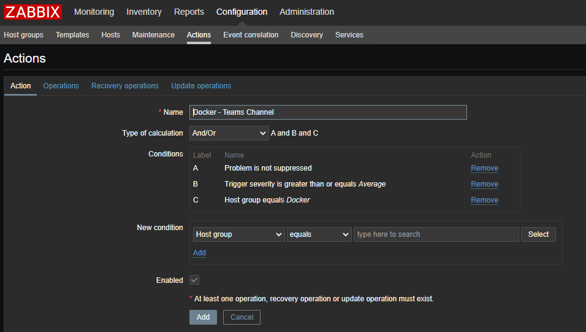
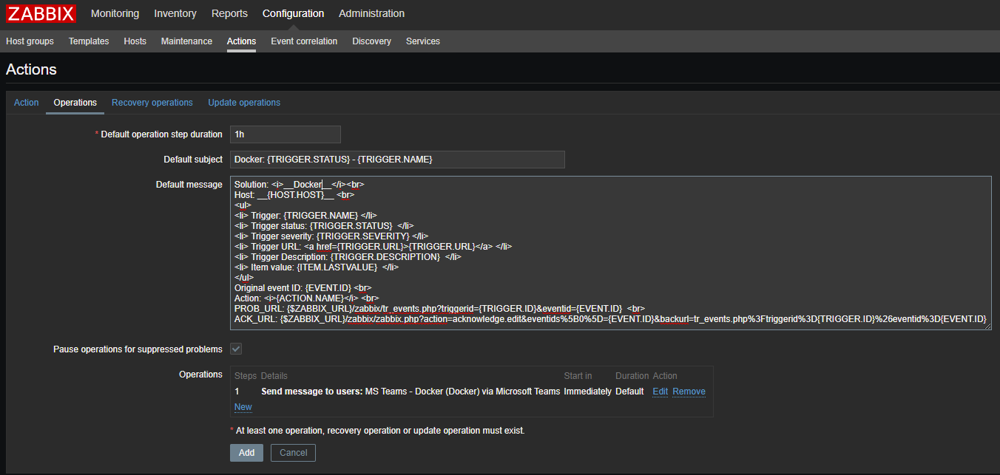
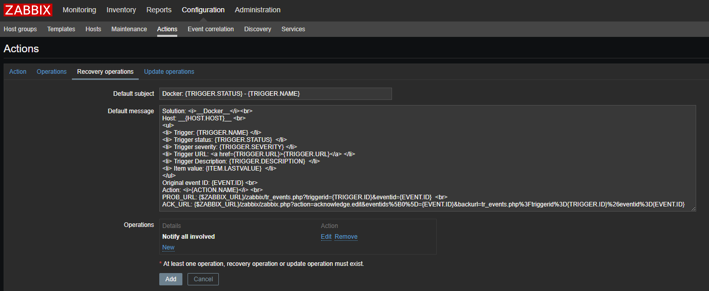
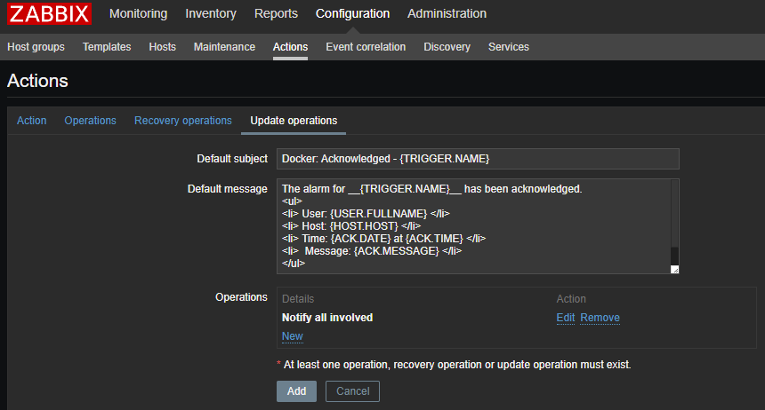

# Zabbix - Teams

## Introduction

This page will show you how to setup and configure the `zabbix-teams.sh` script to be implemented so that you will receive Zabbix problem alerts in the desired Microsoft Teams channel of your choosing.

## Prerequisites

* If a copy of `zabbix-teams.sh` isn't yet located on the Zabbix server being utilized, please perform the following:
  1. `cd /usr/lib/zabbix/alertscrips`
  2. `curl -O https://raw.githubusercontent.com/jaredbrogan/Zabbix-Teams/main/zabbix-teams.sh`
  3. `chown root:zabbix zabbix-teams.sh ; chmod a+x zabbix-teams.sh`
* Once the script has been downloaded and permissions have been corrected, you will now need to perform the frontend setup:
  1. On the Zabbix Frontend, navigate to _Administration_ → _Media Types_
  2. Click _Create media type_ on the top right of the page
  3. Enter the following:
      * _Name:_ **Microsoft Teams**
      * _Type:_ **Script**
      * _Script name:_ **zabbix-teams.sh**
      * _Script parameters:_
        * **{ALERT.SENDTO}**
        * **{ALERT.SUBJECT}**
        * **{ALERT.MESSAGE}**
  4. Leave everything else as default.
  5. Be sure the _Enabled_ checkbox remains checked
  6. Should look like this:


<p align=center>Now that we have the new media type created, we can move forward with the next section! 🙂</p>

## Teams Channel Configuration

With the new media type created, our next step will be to determine where we'll be sending our alerts to.  

Assuming you have the ability to either create a new channel in the desired team of your choice --  
Please perform the following:
1. Navigate to the channel where alerts will be sent to.
2. Click on the ellipsis (…) located to the right of the channel's name
3. Select the _Connectors_ option
4. Locate the _Incoming Webhook_ item and select _Configure_
5. Give a name for this incoming webhook, maybe "Zabbix"
<span></span>
6. Now upload an image for it
    * Feel free to use the image to the right ⟶
    * Now select _Create_
7. Now that the incoming webhook has been created, you should now see a generated webhook URL that can be referenced specifically for this channel

<p align=center>Now would be a good time to copy this URL for the next section 😁</p>

## Zabbix User Configuration

With the Teams setup completed, we will finish our setup on the Zabbix Frontend section.  
First, we will create a new user to be used specifically for this functionality.

Please perform the following:
1. On the Zabbix Frontend, navigate to _Administration_ → _Users_
2. Click _Create media type_ on the top right of the page
3. Enter the following:
    * _Alias:_ **MS Teams - _[Channel Name]_**
    * _Name:_ **_[MS Team Name]_**
    * _Surname:_ **_[Channel Name]_**
    * _Groups:_ **_'No access to the frontend' & 'Microsoft Teams'_**
    * _Password:_ zabbix
        * _Note: This account will not actually be able to login._
4. Click the _Media_ tab above
5. Perform the following:
    * Click the tiny _Add_ button underneath _Type_
    * Select _Microsoft Teams_ from the drop-down menu
    * Copy/paste the previously generated incoming webhook URL into the _Send to_ field
    * Leave _When active_ and _Use if severity_ as default
    * Be sure the _Enabled_ checkbox remains checked
    * Click the _Add_ button
    * Click the _Add_ button again
6. Click the _Permissions_ tab above
7. Select **Zabbix Super Admin** from the _User type_ drop-down menu

<p align=center>With the user now created, we can move on to the final step! 😃</p>

## Zabbix Action Configuration

Now for the final step, we will create a new action in Zabbix.  
Please perform the following:
1. On the Zabbix Frontend, navigate to _Configuration_ → _Actions_
2. Click _Create action_ on the top right of the page
3. Enter the following:
    * _Name:_ **_[HOST GROUP]_ - Teams Channel**
    * _Conditions_
      * Create the following conditions:
        1. **Problem is not suppressed**
        2. **Trigger severity is greater than or equals Average**
        3. **Host group equals _[group(s) that apply]_**
    * Leave everything else on this tab as default
    * Be sure the _Enabled_ checkbox remains checked
4. Click the _Operations_ tab above
    * Enter the following:
      1. _Default subject:_ **_[HOST GROUP]_: {TRIGGER.STATUS} - {TRIGGER.NAME}**
      2. _Default message:_
      >```
      >Solution: <i>__[HOST GROUP]__</i><br>
      >Host: __{HOST.HOST}__ <br>
      ><ul>
      ><li> Trigger: {TRIGGER.NAME} </li>
      ><li> Trigger status: {TRIGGER.STATUS}  </li>
      ><li> Trigger severity: {TRIGGER.SEVERITY} </li>
      ><li> Trigger URL: <a href={TRIGGER.URL}>{TRIGGER.URL}</a> </li>
      ><li> Trigger Description: {TRIGGER.DESCRIPTION}  </li>
      ><li> Item value: {ITEM.LASTVALUE}  </li>
      ></ul>
      >Original event ID: {EVENT.ID} <br>
      >Action: <i>{ACTION.NAME}</i> <br>
      >PROB_URL: {$ZABBIX_URL}/zabbix/tr_events.php?triggerid={TRIGGER.ID}&eventid={EVENT.ID}  <br>
      >ACK_URL: {$ZABBIX_URL}/zabbix/zabbix.php?action=acknowledge.edit&eventids%5B0%5D={EVENT.ID}&backurl=tr_events.php%3Ftriggerid%3D{TRIGGER.ID}%26eventid%3D{EVENT.ID}
      >```
      3. Leave _Pause operations for suppressed problems_ checked
      4. Click _New_ located under the _Operations_ area below
          * Click _Add_ located within the _Send to Users_ section
          * Select the previously created user
          * Select _Microsoft Teams_ from the drop-down menu for the _Send only to_ field
          * Leave _Default message_ checked
          * Under _Conditions_, click _New_
              * There should be a default condition labeled as _Event acknowledged equals Not Ack_
              * Click the **small** _Add_ button
          * Click the <u>**other**</u> **small** _Add_ button
      5. Click the _Recovery operations_ tab above
          * Enter the following:
              1. _Default subject:_ **_[HOST GROUP]_: {TRIGGER.STATUS} - {TRIGGER.NAME}**
              2. _Default message:_
          >```
          >Solution: <i>__[HOST GROUP]__</i><br>
          >Host: __{HOST.HOST}__ <br>
          ><ul>
          ><li> Trigger: {TRIGGER.NAME} </li>
          ><li> Trigger status: {TRIGGER.STATUS}  </li>
          ><li> Trigger severity: {TRIGGER.SEVERITY} </li>
          ><li> Trigger URL: <a href={TRIGGER.URL}>{TRIGGER.URL}</a> </li>
          ><li> Trigger Description: {TRIGGER.DESCRIPTION}  </li>
          ><li> Item value: {ITEM.LASTVALUE}  </li>
          ></ul>
          >Original event ID: {EVENT.ID} <br>
          >Action: <i>{ACTION.NAME}</i> <br>
          >PROB_URL: {$ZABBIX_URL}/zabbix/tr_events.php?triggerid={TRIGGER.ID}&eventid={EVENT.ID}  <br>
          >ACK_URL: {$ZABBIX_URL}/zabbix/zabbix.php?action=acknowledge.edit&eventids%5B0%5D={EVENT.ID}&backurl=tr_events.php%3Ftriggerid%3D{TRIGGER.ID}%26eventid%3D{EVENT.ID}
          >```
          3. Click _New_ located under the _Operations details_ area below
              * Perform the following:
                  1. Under _Operation type_, select **Notify all involved**
                  2. Leave _Default message_ checked
                  3. Click the **small** _Add_ button
    6. Click the _Update operations_ tab above
    * Enter the following:
        1. _Default subject:_ **_[HOST GROUP]_: Acknowledged - {TRIGGER.NAME}**
        2. _Default message:_
        >```
        >The alarm for __{TRIGGER.NAME}__ has been acknowledged.
        ><ul>
        ><li> User: {USER.FULLNAME} </li>
        ><li> Host: {HOST.HOST} </li>
        ><li> Time: {ACK.DATE} at {ACK.TIME} </li>
        ><li>  Message: {ACK.MESSAGE} </li>
        ></ul>
        >
        >Current problem status is __{EVENT.STATUS}__.
        >```
        3. Click _New_ located under the _Operations_ area below
            * Perform the following:
                1. Under _Operation type_, select **Notify all involved**
                2. Under _Default media type_, select **Microsoft Teams**
                3. Leave _Default message_ checked
                4. Click the **small** _Add_ button
    7. Now click the **BIG** _Add_ button
    8. Once created, it should resemble this:

><span></span>
><span></span>
><span></span>
><span></span>

<h3 align=center> And there you go! Everything is finally setup!</h3>
<p align=center>Please enjoy the additional notifications! 😎👍</p>

---

## Author
* [**Jared Brogan**](https://github.com/jaredbrogan)
